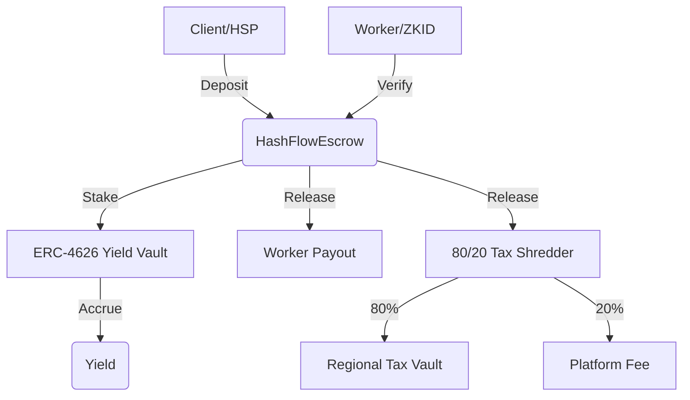

# HashFlow Settlement Protocol (HSP)
### Institutional PayFi | ERC-4626 Yield | ZK-Identity Compliance

**HashFlow** is a next-generation settlement engine built for the **HashKey Ecosystem**, transforming traditional escrow services into programmable, yield-bearing infrastructure. By integrating the **HashKey Settlement Protocol (HSP)** with **ERC-4626** yield vaults and **ZK-Identity**, HashFlow automates jurisdictional tax compliance and eliminates "Dead Capital" in global trade.

---

## 🚀 The Value Proposition

*   **⚡ Programmable Settlement**: Direct integration with the HashKey Settlement Protocol (HSP) for autonomous, multi-milestone payouts.
*   **🏦 Accrued Yield (ERC-4626)**: Idle settlement funds earn real-time yield in HashKey's native vaults, split between workers and the platform.
*   **🛡️ Compliance-as-Code**: Automated jurisdictional tax "shredding" (80/20 split) powered by ZK-Identity verification.
*   **📊 CFO Command Center**: A high-fidelity, institutional-grade dashboard for real-time monitoring of settlement flows and tax liabilities.

---

## 🛠️ Track Alignment

### 1. PayFi Track (HSP integration)
HashFlow implements the `receiveHSPPayment` entry point, allowingregulated merchants and banks to route institutional turnovers directly into HashFlow's programmable engines. This turns static payments into dynamic settlement flows.

### 2. DeFi Track (ERC-4626)
Every dollar locked in HashFlow is immediately staked into **ERC-4626** compliant vaults. We maximize capital efficiency by ensuring that "Time-to-Settlement" is also "Time-to-Yield."

### 3. ZKID Track (Verifiable Identity)
The **ZK-Identity Compliance Gate** ensures that funds are only released to verified entities, satisfying the regulatory requirements of the HashKey Chain while preserving user privacy through zero-knowledge proofs.

---

## 🏗️ Architecture



---

## 🚦 Getting Started (Judge's Guide)

### One-Click Setup
We've provided a simple initialization script to get the environment running locally:

```bash
# Clone and Initialize
./init.sh
```

### Manual Installation
1.  **Contracts**:
    ```bash
    cd contracts
    forge install
    forge build
    ```
2.  **Frontend**:
    ```bash
    cd frontend
    npm install
    npm run dev
    ```

### Artifact Sync Utility
To propagate contract changes to the UI effortlessly:
```bash
cd contracts && node sync-artifacts.js
```

---

## 📜 Project Structure

*   **/contracts**: Foundry-based smart contracts (Solidity ^0.8.24).
*   **/frontend**: Next.js 16 (App Router) with Tailwind v4 and RainbowKit.
*   **/walkthrough.md**: Technical deep-dive into implementation logic.
*   **/pitch.md**: Submission narrative and demo script.

---

## ⚖️ License
MIT © 2026 HashFlow Protocol.
